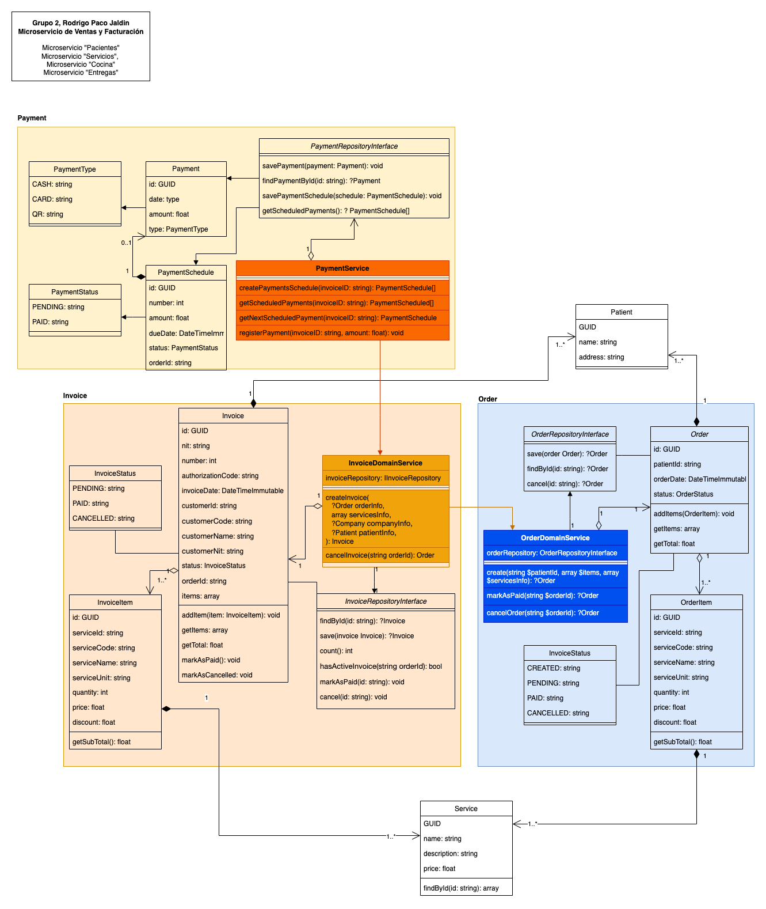

# Sales Micro service

This is an, in progress, micro service to manage sales for "Nur-tricenter", which will manage: sales (orders), invoices and payments. The current development can register/view only sales (orders) and invoices. 

## Class Diagram



## Requirement
- Php 8.2
- composer
- mysql, sqlite

## Installation

If you get the full zip, just uncompress it and run some local web server or some dev web server (from root folder with command line, type)

```bash
php artisan serve
```

You can also get the code using git:

```bash
git clone https://github.com/nur-university/ms2024-tf-rodrigopaco1986.git
```

Install dependencies
```bash
composer install
```
Create a .env file to edit database access. Previously create a database and replace with the credentials in this file
```bash
DB_CONNECTION=mysql
DB_HOST=127.0.0.1
DB_PORT=3306
DB_DATABASE=invoice
DB_USERNAME=root
DB_PASSWORD=root

API_TOKEN=OjqQvWxY7KftqUFRkgvViBBV0bXylx1MggkKAjibsZZGZlivY2ywYXL4Rlfqimbz
```
Run the migrations (to create database tables)
```bash
php artisan migrate
```

## Usage
### Endpoints
Examples are when running project in localhost (php artisan serve). Update the host if it's not the case.

1. Create a sales (order) 
- POST: [http://localhost:8000/order/create](http://localhost:8000/order/create)
- Expected json
```
{
    "patient_id": "dda474a0-71a8-48c0-b348-7f4f212d0bf5",
    "generate_invoice": 0,
    "payment_installments": 1,
    "items": [
        {
            "service_id": "fd47a246-1b53-469a-9ca0-17299e9fc60e",
            "quantity": 1,
            "price": 1000,
            "discount": 0
        },
        {
            "service_id": "02c077f4-9c50-48c2-a7d2-4150f90497a1",
            "quantity": 2,
            "price": 400,
            "discount": 100
        }
    ]
}
```

- Response successfully returns the order
```
{
    "data": {
        "order": {
            "id": "9db22e48-8dc5-4b95-8b22-2e87fb606c20",
            "customer_id": "14931dd7-68b6-4397-a128-872c0bc71f27",
            "order_date": "2024-12-11T03:01:02.000000Z",
            "status": "COMPLETED",
            "total": 723,
            "items": [
                {
                    "id": "9db22e48-8fd9-44ab-8e58-7c5e99975714",
                    "service_id": "fd47a246-1b53-469a-9ca0-17299e9fc67e",
                    "service_code": "39144",
                    "service_name": "Vel exercitationem numquam tempora illo.",
                    "service_unit": "recusandae",
                    "quantity": 1,
                    "price": 123,
                    "discount": 100,
                    "subtotal": 23
                },
                {
                    "id": "9db22e48-9063-42a4-9c7c-1c5f2f9e8ce3",
                    "service_id": "02c077f4-9c50-48c2-a7d2-4150f90497a1",
                    "service_code": "80176",
                    "service_name": "Suscipit voluptatem voluptatem nulla voluptas eligendi.",
                    "service_unit": "est",
                    "quantity": 2,
                    "price": 400,
                    "discount": 100,
                    "subtotal": 700
                }
            ]
        }
    }
}
```
- Response with some error, like invalid id for the patient
```
{
    "errors": {
        "customer_id": [
            "The patient id field must be a valid UUID."
        ]
    }
}
```

2. Get a sales (order) with details
- GET: [http://localhost:8000/order/view/{UUID}](http://localhost:8000/order/view/{UUID})
- No expected input 
- Response successfully returns the order
```
{
    "data": {
        "order": {
            "id": "9db8e37e-a9f9-4726-a28b-c05bbad5eecd",
            "patient_id": "14931dd7-68b6-4397-a128-872c0bc71f27",
            "order_date": "2024-12-14T11:02:42.000000Z",
            "status": "CREATED",
            "total": 1700,
            "items": [
                {
                    "id": "9db8e37e-b0e8-4e5d-8097-802692bb893c",
                    "service_id": "fd47a246-1b53-469a-9ca0-17299e9fc60e",
                    "service_code": "71891",
                    "service_name": "Aut exercitationem quia placeat et.",
                    "service_unit": "magni",
                    "quantity": 1,
                    "price": 1000,
                    "discount": 0,
                    "subtotal": 1000
                },
                {
                    "id": "9db8e37e-b18b-4ed9-9005-4570749d2a31",
                    "service_id": "02c077f4-9c50-48c2-a7d2-4150f90497a1",
                    "service_code": "6931",
                    "service_name": "Dolorem quo dolorem ipsa tenetur aut.",
                    "service_unit": "nihil",
                    "quantity": 2,
                    "price": 400,
                    "discount": 100,
                    "subtotal": 700
                }
            ]
        }
    }
}
```
- Response with some error, like invalid id for the patient
```
{
    "errors": {
        "customer_id": [
            "The patient id field must be a valid UUID."
        ]
    }
}
```

3. Create an invoice 
- POST: [http://localhost:8000/invoice/create](http://localhost:8000/invoice/create)
- Expected json
```
{
    "order_id": "9db8e37e-a9f9-4726-a28b-c05bbad5eecd",
    "customer_id": "14931dd7-68b6-4397-a128-872c0bc71f27"
}
```

- Response successfully returns the invoice
```
{
    "data": {
        "invoice": {
            "id": "9db8ed70-11c7-4394-96c0-2f4308101285",
            "nit": "171283817238128",
            "number": 2,
            "authorization_code": "465A9780DBD5FD71F22F720B938CAF5AE3EB03980654FFCCE54549E74",
            "invoice_date": "2024-12-14T11:30:30.000000Z",
            "customer_id": "14931dd7-68b6-4397-a128-872c0bc71f27",
            "customer_code": 1180,
            "customer_name": "Janiya Schiller",
            "customer_nit": "7659198",
            "status": "CREATED",
            "total": 1700,
            "items": [
                {
                    "id": "9db8ed70-1244-43c2-89db-c9be0f18eb2f",
                    "service_code": "542",
                    "service_name": "Cumque nostrum tenetur maiores iure.",
                    "service_unit": "deleniti",
                    "quantity": 1,
                    "price": 1000,
                    "discount": 0,
                    "subtotal": 1000
                },
                {
                    "id": "9db8ed70-1298-42cd-8352-d0e10789db6b",
                    "service_code": "19997",
                    "service_name": "Dolorem rerum nam quae impedit error.",
                    "service_unit": "quis",
                    "quantity": 2,
                    "price": 400,
                    "discount": 100,
                    "subtotal": 700
                }
            ]
        }
    }
}
```
- Response with some error, like invalid id for the patient
```
{
    "errors": {
        "customer_id": [
            "The patient id field must be a valid UUID."
        ]
    }
}
```

4. Get an invoice with details
- GET: [http://localhost:8000/order/view/{UUID}](http://localhost:8000/order/view/{UUID})
- No expected input 
- Response successfully returns the invoice
```
{
    "data": {
        "invoice": {
            "id": "9db8ed4f-7ac0-42a8-8d47-41f6f49ba004",
            "nit": "171283817238128",
            "number": 1,
            "authorization_code": "465A9780DBD5FD71F22F720B938CAF5AE3EB03980654FFCCE54549E74",
            "invoice_date": "2024-12-14T11:30:09.000000Z",
            "customer_id": "14931dd7-68b6-4397-a128-872c0bc71f27",
            "customer_code": 999,
            "customer_name": "Prof. Allan Pollich",
            "customer_nit": "1740430",
            "status": "CREATED",
            "total": 1700,
            "items": [
                {
                    "id": "9db8ed4f-7ffd-44ab-a593-08174bc638b0",
                    "service_code": "41941",
                    "service_name": "Ab qui corporis unde.",
                    "service_unit": "ex",
                    "quantity": 1,
                    "price": 1000,
                    "discount": 0,
                    "subtotal": 1000
                },
                {
                    "id": "9db8ed4f-8050-4b80-9247-e16694e25615",
                    "service_code": "88176",
                    "service_name": "Et rerum qui.",
                    "service_unit": "magni",
                    "quantity": 2,
                    "price": 400,
                    "discount": 100,
                    "subtotal": 700
                }
            ]
        }
    }
}
```
- Response with some error, like invalid id for the patient
```
{
    "errors": {
        "customer_id": [
            "The patient id field must be a valid UUID."
        ]
    }
}
```


### TODO
- Update class diagram
- Register payment from patient
- Add tests (feature and unit tests)
- Enable queues to send async invoice by email once is generated
## Dev notes
### Linter the code:
```bash
./vendor/bin/pint
```